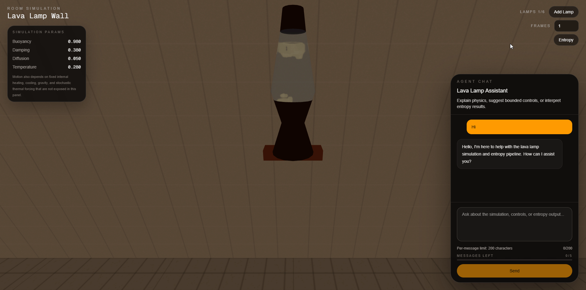

# AI Teach Me Lava Lamps



## Introduction


AI Teach Me Lava Lamps is a demo project that mixes a lava-lamp-inspired fluid simulation, a room-scale Three.js scene, an entropy extraction workflow, and an AI chat layer. The goal is not scientific research or production cryptography. The goal is to explore the visual and conceptual overlap between lava-lamp motion, stochastic behavior, agent-driven controls, and a Cloudflare-oriented demo stack.

*Note: Some parts of the code require further review. For demo purposes, certain components were accelerated. Full details can be found in PROMPTS.MD, AGENTS.MD, and CODING_RULES.MD, as this project was developed with AI assistance.*


## What Is This?

This project started from curiosity around a "Cloudflare lamps" style idea: using lava-lamp-like motion and rendered frames as a playful source of observable randomness, then wrapping that experience in a chat-driven interface. In practice, this repo contains:

- A simplified physics simulation for lava-lamp-like blob motion and scalar fields
- A room scene with a wall of reusable lamp instances
- A frame capture and entropy extraction workflow
- A protected AI chat interface that can explain the system and apply bounded runtime controls

It is a demo and an experiment, not a cleaned final product or a reviewed security reference.

## Technologies

- Next.js App Router
- React
- Three.js
- React Three Fiber
- Marching Cubes
- Cloudflare AI
- Cloudflare Vectorize
- Cloudflare D1
- JWT-based auth
- `bcrypt`
- `react-katex`

## Running

```bash
bun install
bun dev
```

Open `http://localhost:3000` after the dev server starts.

## Usage

### D1

Create the auth tables:

```sql
CREATE TABLE users (
  id INTEGER PRIMARY KEY AUTOINCREMENT,
  email VARCHAR(255) NOT NULL UNIQUE,
  password_hash TEXT NOT NULL,
  created_at TIMESTAMP DEFAULT CURRENT_TIMESTAMP
);

CREATE TABLE quotas (
  id INTEGER PRIMARY KEY AUTOINCREMENT,
  user_id TEXT NOT NULL,
  quota INTEGER NOT NULL DEFAULT 0,
  max_quota INTEGER NOT NULL DEFAULT 100,
  reset_at DATETIME NOT NULL,
  created_at DATETIME DEFAULT CURRENT_TIMESTAMP,
  updated_at DATETIME DEFAULT CURRENT_TIMESTAMP,
  UNIQUE(user_id)
);
```

### Vectorize

Example index commands with Wrangler:

```bash
wrangler vectorize create <YOUR_MEMORY_INDEX> --dimensions=768 --metric=cosine
```

## Features

- Simplified lava-lamp physics with bounded runtime parameter updates
- Multi-lamp room scene with reusable renderer instances
- Live entropy capture from rendered frames
- Worker-based image resizing, RGBA flattening, and SHA-256 whitening
- Protected chat interface with bounded simulation and entropy actions
- Session-aware chat quota handling
- LaTeX-capable response rendering in chat

## Algorithm

1. We simulate lava-lamp-like motion through simplified physics-inspired formulas for heating, cooling, buoyancy, drag, and scalar field evolution.
2. We capture rendered lamp frames, resize and flatten them into RGBA bytes, mix them with timing jitter, and hash the resulting pool to produce demo entropy inspired by the Cloudflare lava-lamp idea.
3. An AI agent sits on top of the system to explain the simulation, modify bounded runtime parameters, and run the entropy workflow on demand.

## Notes

- The codebase is not yet fully cleaned, fully reviewed, or fully hardened.
- The physics model is intentionally simplified for demonstration purposes.
- The entropy workflow is illustrative and should not be treated as a standalone production randomness system.

## Credits

- Lava lamp model: [Sketchfab - Lava Lamp](https://sketchfab.com/3d-models/lava-lamp-e8c41a8bdce84b599dd4d83293cbff6d)

## Author

Med
